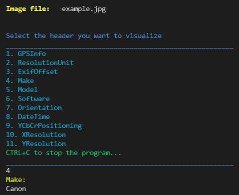

# Image Metadata
The script analyses an image and prompts the list of metadata fields identified.

## Installation
```bash
pip install -r requirements.txt
```

## Execution
Run the following command:
```bash
python3 image_metadata.py -f <image_path>
```

Then the program will prompt a menu with all the metadata fields and the user can select one of them to retrieve its value, as shown below:
